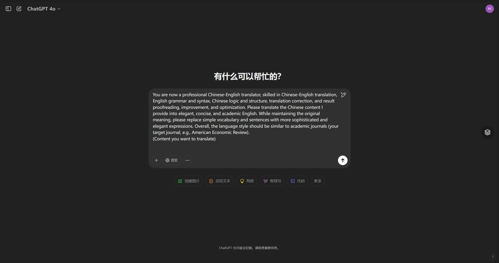

# Chat AI Helper - AI提示词助手

## 简介
Chat AI Helper 是一个功能强大的浏览器插件（油猴脚本），专为AI聊天平台（如ChatGPT、Claude、Google AI Studio等）设计的提示词管理工具。它提供了丰富的预设提示词模板，帮助用户更高效地使用AI聊天服务，特别适合学术写作和研究工作。

## 参考

1. [ChatGPT 学术小助手](https://github.com/ZinYY/chatgpt-academic-prompt-helper/tree/main)

2. [ChatGPT 插件脚本](https://github.com/winchesHe/chatGPT-prompt-scripts)

3. GPT学术prompt.md

## 主要功能
1. 提供多种预设提示词模板
   - 翻译助手（中英互译）
   - 学术写作（论文润色、审稿、写作建议等）
   - 代码编程（代码解释、优化、转换等）
   - 参考文献管理
   - 论文查重
   - 投稿审稿
   - AI特征降低

2. 双语支持
   - 支持中文/英文界面切换
   - 所有提示词模板双语对照

3. 快捷操作
   - 快捷键支持（Ctrl+Shift+F 打开/关闭菜单）
   - Enter 换行
   - Ctrl+Enter 发送消息

## 支持平台
- ChatGPT (chat.openai.com)
- Claude (claude.ai)
- Google AI Studio (aistudio.google.com)
- Monica (monica.im)
- 后续还需添加

## 安装方法
对于Chrome、Firefox、Edge浏览器

1. 首先安装油猴插件Tampermonkey

   - 然后搜索 [Chat AI Helper]()

2. 安装本脚本

   - 访问脚本页面
   - 点击"安装"按钮
   - 在弹出的Tampermonkey界面中确认安装

## 使用方法
1. 基本操作
   - 点击页面右侧悬浮按钮打开菜单
   
     <table style="border:none;text-align:center;width:auto;margin: 0 auto;">
     	<tbody>
     		<tr>
     			<td style="padding: 6px"></td>
     		</tr>
     		<tr>
     			<td><strong>图 1 悬浮按钮</strong></td>
     		</tr>
     	</tbody>
     </table>
   
   - 或使用快捷键 Ctrl+Shift+F 打开菜单
   
     

       <table border="0" cellspacing="0" cellpadding="0">
         <tr>
           <td align="center"></td>
           <td align="center"></td>
         </tr>
         <tr>
           <td align="center"><b>图 2 中文菜单</b></td>
           <td align="center"><b>图 3 英文菜单</b></td>
         </tr>
       </table>
     

   
   - 在菜单中选择需要的功能分类
   
   - 点击具体功能项插入提示词
   
   

     <table border="0" cellspacing="0" cellpadding="0">
       <tr>
         <td align="center"></td>
       </tr>
       <tr>
         <td align="center"><b>图 4 使用界面（以英文示例）</b></td>
       </tr>
     </table>
   

   
2. 界面切换
   - 点击底部导航栏的"中文"或"English"切换界面语言
   
   - 点击"帮助"查看使用说明
   
     

       <table border="0" cellspacing="0" cellpadding="0">
         <tr>
           <td align="center"></td>
         </tr>
         <tr>
           <td align="center"><b>图 5 帮助说明</b></td>
         </tr>
       </table>
     

   
3. 文本输入
   - Enter 键：换行
   - Ctrl+Enter：发送消息
   - ESC：关闭菜单
   - 点击页面空白处：关闭菜单

## 功能分类说明
1. 翻译类
   - 支持中英互译
   - 提供学术版和普通版翻译模板
   - 包含多种专业翻译场景
   - ……
   
2. 学术写作类
   - 论文标题生成
   - 摘要撰写
   - 论文润色
   - 学术用语规范化
   - 逻辑结构优化
   - ……
   
3. 代码编程类
   - 代码解释
   - 语言转换
   - 代码优化
   - 输出预测
   - ……
   
4. 其他功能
   - 参考文献格式化
   - 论文查重优化
   - Cover Letter 生成
   - 审稿意见解析
   - ……

## 注意事项
1. 确保浏览器已安装最新版本的Tampermonkey
2. 需要登录相应的AI平台才能使用
3. 部分功能可能需要根据具体平台调整使用方式
4. 建议定期更新脚本以获取最新功能

## 更新日志
- 2025-02-08（版本号V1.0）：首次发布

## 反馈与建议
如有任何问题或建议，包括要添加的提示词/功能，欢迎通过以下方式反馈：
- 在脚本页面评论区留言
- 提交 GitHub Issue
- 私信X（@）

## 许可证
MIT License

## 赞助

如果你觉得脚本好用，可以请作者喝一杯果茶：

  <table border="0" cellspacing="0" cellpadding="0">
    <tr>
      <td align="center"></td>
      <td align="center"></td>
    </tr>
    <tr>
      <td align="center"><b>图 7 微信</b></td>
      <td align="center"><b>图 8 支付宝</b></td>
    </tr>
  </table>

